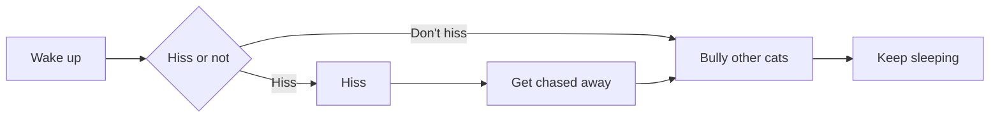

# Round-headed Maodie · Maodie

> A water gun doesn't even work!
>
> —— Bilibili, *What I'd Call the Strongest Battle Cat in History*, 02:11

**Maodie** is a light theme designed for Typora 1.13. Dark gold-brown as the primary color, cream base with deep red-brown text — calm, non-glaring, easy on the eyes for long writing sessions. Just watch out, it loves to hiss at you.

## Table of Contents

[TOC]

## What kind of cat is this

- **Dark gold-brown palette**: an 12-color set, from milk-cream to deep brown-black, from amber gold to deep sea blue
- **Many Maodies**: a bike-riding one, a building-jumping one... sneaking in hisses when you aren't looking
- **Full coverage**: 55 CSS sections take over the entire Typora interface — all-round, three-dimensional, multi-faceted hissing
- **Rich editor feedback**: cat faces marking heading levels, decoration bars on code blocks, auto-resizing Mermaid diagrams

## Installation

Place `maodie.css` and the `maodie/` subdirectory into the Typora themes directory. Open the theme folder via Preferences → Appearance.

Restart Typora, then go to **Menu Bar → Themes → maodie**. Effective immediately.

```ProjectStructure
Project structure:
     themes/
     ├── maodie.css              ← this file
     └── maodie/
        ├── fonts/
        │   ├── newsreader.woff2
        |	├── newsreader-italic.woff2  embedded font
        |	└── OFL.txt
        ├── cat.gif
        ├── run.gif
        ├── run2.gif            ← alternative version of running Maodie
        ├── run3.gif            ← alternative version of running Maodie
        ├── run4.gif            ← alternative version of running Maodie
        ├── face-1.png
        ├── face-2.png
        ├── face-3.png
        ├── face-4.png
        ├── face-5.png
        └── face-6.png
```

## Color Palette

| Variable | Value | Purpose |
|--------|------|------|
| `--bg-main` | `#FAF3E5` | milk-cream base |
| `--bg-raised` | `#F5EAD0` | lightened milk-tea |
| `--bg-deep` | `#E5D4AB` | deep milk-tea sidebar |
| `--text-primary` | `#39140A` | very deep red-brown-black |
| `--text-secondary` | `#805C30` | Secondary text / Italic |
| `--text-muted` | `#8E7858` | Subdued text / Annotation |
| `--accent` | `#926E39` | dark gold-brown UI accent |
| `--accent-bright` | `#6E4E20` | deep brown links / focus |
| `--border` | `#DCC6A0` | Generic border |
| `--c-amber` | `#AE7821` | amber gold for code strings |
| `--c-blue` | `#2A5482` | deep sea blue for function names |
| `--c-rose` | `#B82318` | pure red for exception warnings |

## Feature Demos

### Heading Levels

Click into each of the headings below to enter edit mode. On the left, you'll see Maodie faces in decreasing size.

#### This is a level-4 heading

##### This is a level-5 heading

###### This is a level-6 heading

### Inline Emphasis

Regular text uses text-primary, a very deep red-brown-black. **Bold uses font-weight 600**, *italic leans slightly*, ~~strikethrough cuts across~~ to mark something deprecated. ==Mark highlights== sit on an amber-gold ground, like a real marker pen. `Inline code` is its own little bubble, with independent coloring.

Subscript and superscript work too: H~2~O is the chemical formula for water, E = mc^2^ is mass-energy equivalence.

Links have two states: by default, [a low-emphasis underline](https://typora.io); on hover, [solid accent-bright](https://typora.io).

### Lists

#### Multi-level Maodie unordered list

- Level 1: face-1, big hajimi
  - Level 2: face-2, medium hajimi
    - Level 3: face-3, small hajimi
      - Level 4: face-4, tiny hajimi
        - Level 5: face-5, same size as level 4 — the small ones are cute too
          - Level 6: falls back to native, color text-muted
            - Level 7: disc at 65% color
              - Level 8: disc at 45% color
                - How did you know there's a level 9

#### Ordered list

1. Hiss
2. Get pecked by a chicken
3. Bully other cats
4. Sleep
5. Keep hissing

#### Task list

- [x] 12-color dark gold-brown palette
- [x] Biking Maodie and running Maodie
- [x] Heading edit-mode level cat faces
- [x] Mermaid auto-height
- [ ] Dark mode? Nope, not doing it

### Blockquotes

A plain blockquote, left bar in accent dark gold-brown, background a soft accent:

> Hajimi nanbei lüdou

Nested blockquotes, color fading one level at a time:

> Level 1: Ashi haya ku nailong
>
> > Level 2: Wa sha ma jili manbo
> >
> > > Level 3: Hajimi nanbei lüdou
> > >
> > > > Level 4: Jimi ashiga ashi
> > > >
> > > > > Level 5: Yeda yeda manbo — bottoms out, no more fading
> > > > >
> > > > > > Level 6: Jimi haya ku nailong

### Callouts

Five GitHub-style admonition boxes:

> [!NOTE]
> NOTE marks general supplementary information. Left bar: deep sea blue.

> [!TIP]
> TIP shares a practical pointer. Left bar: dark green, matching GitHub's default tip color.

> [!IMPORTANT]
> IMPORTANT is a heavyweight notice. Left bar: deep brown, carrying the most visual weight.

> [!WARNING]
> WARNING level. Left bar: amber gold.

> [!CAUTION]
> CAUTION level. Left bar: pure red — the strongest visual warning.

### Code Blocks

JavaScript:

```javascript
// Notice fn cm-def in bold blue, keywords in bold deep brown
const greetCat = (name) => {
    const greeting = `Hello, ${name}!`;
    return greeting;
};

async function fetchCatPhoto(id) {
    try {
        const response = await fetch(`/api/cats/${id}`);
        if (!response.ok) {
            throw new Error("Cat photo fetch failed");
        }
        return await response.json();
    } catch (err) {
        console.error(err);
        return null;
    }
}

greetCat("Maodie");
```

Python:

```python
class Maodie:
    """A Maodie cat."""

    def __init__(self, name: str):
        self.name = name
        self.mood = "calm"

    def purr(self) -> str:
        return f"{self.name} lets out a hiss"

    @property
    def is_hungry(self) -> bool:
        return self.mood == "demanding"


mao = Maodie("Orange tabby")
print(mao.purr())  # Orange tabby lets out a hiss
```

Rust:

```rust
fn main() {
    let cats: Vec<&str> = vec!["Maodie", "Hajimi", "Nanbei-luduo"];
    for cat in &cats {
        println!("A cat named {}", cat);
    }
}
```

Shell:

```bash
# Deploy the maodie theme to the Typora themes directory
THEME_DIR="$HOME/Library/Application Support/abnerworks.Typora/themes"
cp -r maodie.css maodie/ "$THEME_DIR/"
echo "Maodie has hissed"
```

HTML:

```html
<!-- This is an HTML comment -->
<article class="cat-card" data-name="Maodie">
    <h3>About Maodie</h3>
    <p>Weight: <strong>???kg</strong></p>
    
</article>
```

Diff:

```diff
  function feedCat(cat) {
-     cat.food = "cat food";
+     cat.water = "water gun";
      return cat;
  }
```

### Mermaid Flowchart

A Maodie's morning decision flow:



### Tables

Maodie observation log across different hours of the day:

| Hour | Activity | Notes |
| ---- | ---- | ------ |
| Pre-dawn | Hissing | Hajimi |
| Morning | Hissing | Hajimi |
| Noon | Hissing | Hajimi |
| Afternoon | Hissing | Hajimi |
| Evening | Hissing | Hajimi |
| Late night | Hissing | Hajimi |

The third column is right-aligned, demonstrating the table's column-align.

### Math Formulas

Inline formula: a Maodie's comfort level can be expressed as $C = f(\text{white socks}, \text{cat food}, \text{hissing})$

Block formula, the classic Gaussian integral:

$$
\int_{-\infty}^{\infty} e^{-x^2} \, dx = \sqrt{\pi}
$$

Nothing to do with Maodie, but very elegant. Click into edit mode and the formula editing area is milk-tea colored, not Typora's default `#F5F6F7` gray-white.

### Images

Theme asset face-1, a 64×64 circular cat-face crop:


If you can't see the image above, the `maodie/` subdirectory isn't in place yet.

### Horizontal Rule

Below is a horizontal rule, separating upper and lower context. Lighter in weight than an `##` heading, like the soft sound of a Maodie's hiss:

---

### Footnotes

The name "Maodie" doesn't really come from any deep backstory[^1] — it's named that way simply because it loves to hiss. Hover over the footnote marker above and a preview pops up.

[^1]: Hajimi hisses and gets hissed back at — here's the upper couplet, looking for a matching lower one:

## Credits

- Maodie itself, Hajimi itself
- All the Claudes that kept me company through the late-night theme-writing

## License

Use it however you want. If you find this cat keeps you comfortable company, no need to thank it — it'll come over to hiss at you in a moment.

## Other

This is the last paragraph of regular body text. If you scrolled down this far, you should already see a Maodie cosplaying the falling-cat meme, dropping endlessly along the right-side scrollbar. If you open the sidebar, there should be another Maodie at the bottom-left riding a bicycle in a loop — press and hold to make it jump. If both of them show up, the theme is working properly.

Want me to write a bit more so the scrollbar grows longer and the falling cat doesn't crash? Here's another stretch:

Maodie

is

a

way

of life.

An

excellent

Maodie

doesn't

care

what

document

you're

writing,

it only

cares

about

hissing.

It won't

rush

you,

but it

will

look at you

with

a

calm,

unquestionable

gaze,

and then

start

hissing.


Hiss.
