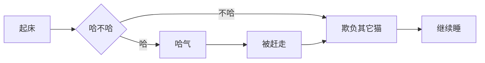

# 圆头耄耋 · Maodie

> 水枪也没用啊！
>
> —— Bilibili《我愿称之为史上最强战猫》02:11

**Maodie** 是一只基于 Typora 1.13 设计的浅色主题。暗金棕作主色，奶油底配深红棕字，气质沉稳、不刺眼，长时间写作不累，就是容易被哈气。

## 目录

[TOC]

## 这是一只什么样的猫

- **暗金棕配色**：12 色色板，从米奶油到深棕黑，从赤金到深海蓝
- **很多只耄耋**：骑车的、跳楼基……趁你不注意偷偷哈气
- **完整覆盖**：55 节 CSS 全方位接管 Typora 界面，全方位、立体化、多元化的哈气
- **编辑反馈丰富**：标题层级猫脸、代码块装饰条、Mermaid 自适应

## 安装

将 `maodie.css` 与 `maodie/` 子目录放到 Typora 主题目录（在偏好设置-外观中打开主题文件夹）：

重启打开 Typora，**菜单栏 → 主题 → maodie**，即刻生效。

```项目结构
项目结构：
     themes/
     ├── maodie.css              ← 本文件
     └── maodie/
        ├── fonts/
        │   ├── newsreader.woff2
        |	├── newsreader-italic.woff2 内嵌字体
        |	└── OFL.txt
        ├── cat.gif             
        ├── run.gif             
        ├── run2.gif            ← 跑步耄耋备选动画（替换 run.gif 即可换款）
        ├── run3.gif            ← 同上，备选
        ├── run4.gif            ← 同上，备选
        ├── face-1.png          
        ├── face-2.png          
        ├── face-3.png          
        ├── face-4.png          
        ├── face-5.png          
        └── face-6.png          
```

## 配色板

| 变量名 | 色值 | 用途 |
|--------|------|------|
| `--bg-main` | `#FAF3E5` | 米奶油底 |
| `--bg-raised` | `#F5EAD0` | 提亮奶茶色 |
| `--bg-deep` | `#E5D4AB` | 深奶茶侧栏 |
| `--text-primary` | `#39140A` | 极深红棕黑 |
| `--text-secondary` | `#805C30` | 次要文本 / 斜体 |
| `--text-muted` | `#8E7858` | 弱化文本 / 注释 |
| `--accent` | `#926E39` | 暗金棕 UI 主强调 |
| `--accent-bright` | `#6E4E20` | 深棕链接 / focus |
| `--border` | `#DCC6A0` | 通用边框 |
| `--c-amber` | `#AE7821` | 赤金字符串 |
| `--c-blue` | `#2A5482` | 深海蓝函数名 |
| `--c-rose` | `#B82318` | 纯红异常警示 |

## 功能演示

### 标题层级

下面几个标题各试着点一下进入编辑态，左侧会看到递减大小的耄耋脸。

#### 这是四级标题

##### 这是五级标题

###### 这是六级标题

### 行内强调

普通文本是 text-primary 极深红棕黑。**加粗用 600 字重**，*斜体微微倾斜*，~~删除线穿过~~ 表示废弃。==Mark 高亮== 走赤金底色，是一支马克笔的手感。`行内代码` 单独一颗气泡，独立配色。

上下标也支持：H~2~O 是水的化学式，E = mc^2^ 是质能等价。

链接走两态：默认 [低强调下划线](https://typora.io)，hover 时跳到 [实色 accent-bright](https://typora.io)。

### 列表

#### 无序列表的多层耄耋

- 一级 face-1 大基米
  - 二级 face-2 中基米
    - 三级 face-3 小基米
      - 四级 face-4 小小基米
        - 第五层项目 face-5 同四层一样大小，小小的也很可爱
          - 第六层退回原生，颜色 text-muted
            - 第七层 disc 颜色 65%
              - 第八层 disc 颜色 45%
                - 你怎么知道还有第九层

#### 有序列表

1. 哈气
2. 被鸡啄
3. 欺负其它猫
4. 睡觉
5. 继续哈气

#### 任务列表

- [x] 暗金棕 12 色色板
- [x] 骑车耄耋与跑步耄耋
- [x] 标题编辑态层级猫脸
- [x] Mermaid 自适应高度
- [ ] dark mode 暗色版？我才不做

### 引用

普通引用，左条 accent 暗金棕，背景淡 accent：

> 哈基米南北绿豆

嵌套引用，深层颜色逐级淡出：

> 一级：阿西哈呀库奶龙
>
> > 二级：哇夏马几力曼波
> >
> > > 三级：哈基米南北绿豆
> > >
> > > > 四级：基米阿西嘎阿西
> > > >
> > > > > 五级：耶哒耶哒曼波（触底不再继续淡化）
> > > > >
> > > > > > 六级：基米哈压库奶龙

### Callouts

五种 GitHub 风格的警告框：

> [!NOTE]
> NOTE 标注一般性补充信息，左条深海蓝。

> [!TIP]
> TIP 提示一个实用技巧，左条暗绿，对应 GitHub 默认 tip 约定色。

> [!IMPORTANT]
> IMPORTANT 是重磅级提示，左条深棕，视觉权重最大。

> [!WARNING]
> WARNING 警告级，左条赤金。

> [!CAUTION]
> CAUTION 警示级，左条纯红，最强的视觉警告。

### 代码块

JavaScript：

```javascript
// 看 fn cm-def 蓝色加粗，关键字深棕加粗
const greetCat = (name) => {
    const greeting = `你好，${name}！`;
    return greeting;
};

async function fetchCatPhoto(id) {
    try {
        const response = await fetch(`/api/cats/${id}`);
        if (!response.ok) {
            throw new Error("猫片获取失败");
        }
        return await response.json();
    } catch (err) {
        console.error(err);
        return null;
    }
}

greetCat("耄耋");
```

Python：

```python
class Maodie:
    """一只耄耋"""

    def __init__(self, name: str):
        self.name = name
        self.mood = "calm"

    def purr(self) -> str:
        return f"{self.name} 发出哈气声"

    @property
    def is_hungry(self) -> bool:
        return self.mood == "demanding"


mao = Maodie("橘猫")
print(mao.purr())  # 橘猫 发出哈气声
```

Rust：

```rust
fn main() {
    let cats: Vec<&str> = vec!["耄耋", "哈基米", "南北路多"];
    for cat in &cats {
        println!("一只猫叫做 {}", cat);
    }
}
```

Shell：

```bash
# 部署 maodie 主题到 Typora 主题目录
THEME_DIR="$HOME/Library/Application Support/abnerworks.Typora/themes"
cp -r maodie.css maodie/ "$THEME_DIR/"
echo "耄耋已哈气"
```

HTML：

```html
<!-- 这是 HTML 注释 -->
<article class="cat-card" data-name="耄耋">
    <h3>耄耋的简介</h3>
    <p>体重：<strong>???kg</strong></p>
    
</article>
```

Diff：

```diff
  function feedCat(cat) {
-     cat.food = "猫粮";
+     cat.water = "水枪";
      return cat;
  }
```

### Mermaid 流程图

耄耋的早晨决策流：



### 表格

不同时辰的耄耋观测记录：

| 时辰 | 活动 | 备注   |
| ---- | ---- | ------ |
| 凌晨 | 哈气 | 哈基米 |
| 早晨 | 哈气 | 哈基米 |
| 中午 | 哈气 | 哈基米 |
| 下午 | 哈气 | 哈基米 |
| 傍晚 | 哈气 | 哈基米 |
| 深夜 | 哈气 | 哈基米 |

第三列右对齐，演示表格的 column-align。

### 数学公式

行内公式：耄耋的舒适度可以表示为 $C = f(\text{白手套}, \text{猫粮}, \text{哈气})$

块级公式，经典高斯积分：

$$
\int_{-\infty}^{\infty} e^{-x^2} \, dx = \sqrt{\pi}
$$

与耄耋无关，但很优雅。点击进入编辑态，公式编辑区是奶茶色，不是 Typora 默认的灰白。

### 图片

主题资源 face-1 大头猫，64×64 圆形扣脸：


如果上面看不到图片，说明 `maodie/` 子目录还没就位。

### 水平线

下面是一条水平线，分隔上下文，气质比 ## 标题轻，像耄耋的哈气声一样：

---

### 脚注

耄耋这个名字没有什么来源典故 [^1]，用它命名就是因为爱哈气。鼠标放在上面的脚注角标，会弹出预览。

[^1]: 哈基米哈气被人哈，求下联：

## 鸣谢

- 耄耋本耋，哈基米本基
- 写主题时陪我熬夜的所有 Claude

## 许可

随便用。如果觉得这只猫陪你待得舒服，不用感谢它，它马上来找你哈气。

## 其他

最后一段普通正文。如果你滚到这里，应该已经看见右侧滚动条上一直在往下掉 cos 跳楼基的耄耋。如果你打开侧栏，左下角应该有另一只耄耋在骑自行车循环往复（长按触发跳跃）。如果两只都在，主题就算工作正常。

要再多写一点东西让滚动条变长好让跳楼基不要摔死吗？那再来一段：

耄耋

是一种

生活

态度。

一只

优秀的

耄耋

不会

在乎

你正在

写什么

文档，

它只在乎

哈气。

它不会

催你，

但它

会用

一种

平静

而

不容置疑的

目光

看着你，

然后

开始哈气。


哈。
