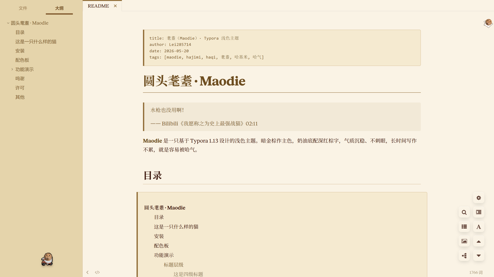
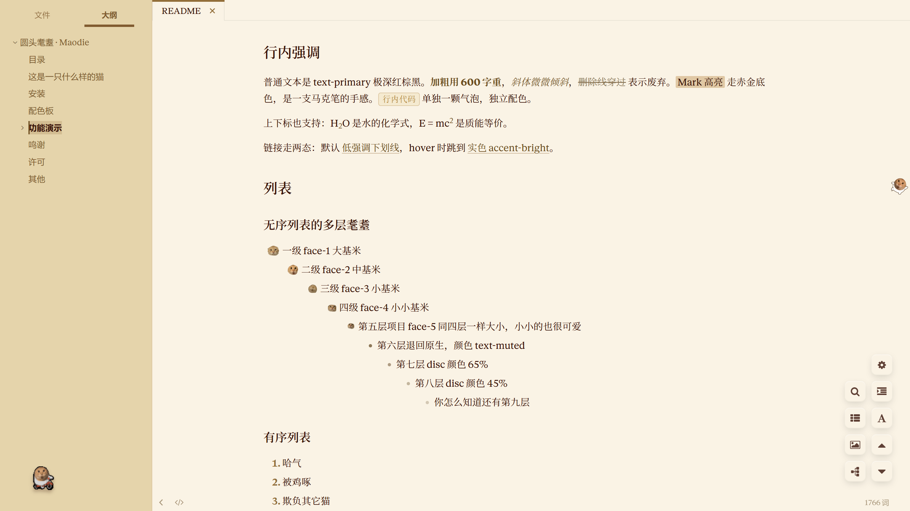
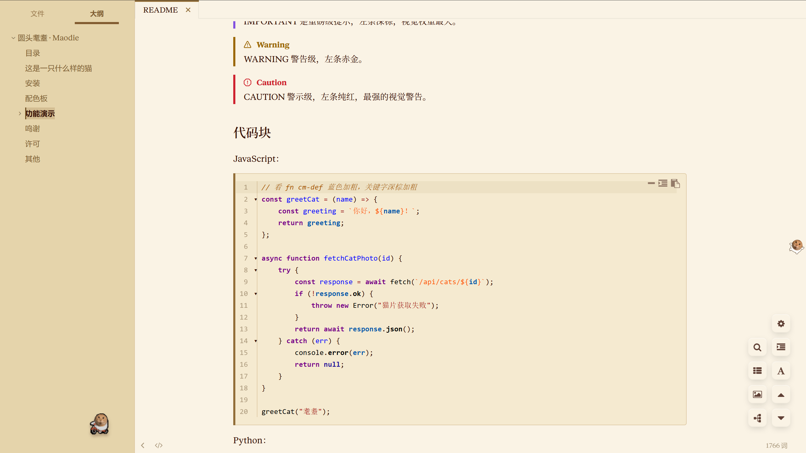
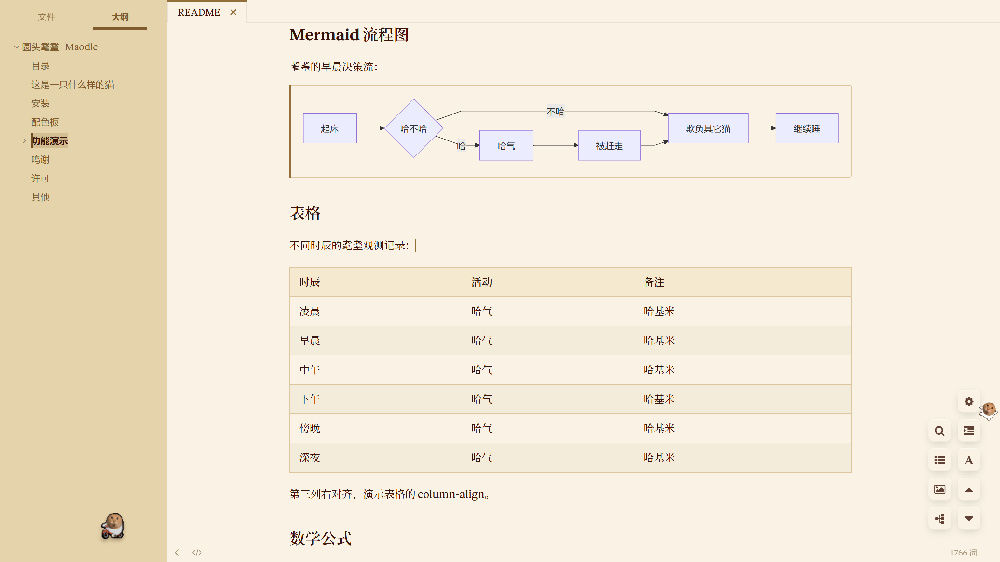

# Round-headed Maodie · Maodie

> A water gun doesn't even work!
>
> —— Bilibili, *What I'd Call the Strongest Battle Cat in History*, 02:11

A dark gold-brown light theme designed for [Typora](https://typora.io) 1.13+. Cream base with deep red-brown text — calm, non-glaring, easy on the eyes for long writing sessions.

Two Maodies are hidden inside the theme: one at the bottom of the sidebar, looping on a bicycle, and one clinging to the document's scrollbar, dropping in place. Click any heading and a matching number of Maodie faces will appear on the left as a level indicator.

After installation, start by reading the `Function-demonstration-EN.md` inside the project folder to experience the hissing for yourself.

## Preview









## Installation

Place `maodie.css` and the `maodie/` subdirectory into the Typora themes directory. Open the theme folder via Preferences → Appearance.

Restart Typora, then go to **Menu Bar → Themes → maodie**. Effective immediately.

## Design Highlights

**11-color palette**: from milk-cream base to deep red-brown text, from amber gold to deep sea blue for code. The full palette is extracted into CSS variables defined on `:root`, making it easy to extend or derive new variants.

**Two distinct shades of gold-brown**: the UI's main accent uses `#926E39`, a steady burnt gold; code strings use `#AE7821`, a brighter clear gold. Code strings are louder than the UI accent on purpose, because code gets read more often.

**Rich editor feedback**: headings entering edit mode show level cat faces — H1 = 1 face at 20px, H6 = 6 faces at 10px. Code block decoration bars precisely cover the border miter joints. The formula editing area's background matches the document's tone, instead of Typora's default `#F5F6F7` gray.

**Two Maodies**: one GIF rides a bike in a loop at the bottom of the sidebar — hover to pause, press and hold to make it jump. The other clings to the thumb of the main scrollbar, its position naturally moving with the scroll percentage. Pure CSS, no JS.

## Project Structure

```
themes/
├── maodie.css                  main stylesheet, ~2600 lines, 55 sections
└── maodie/ 
    ├── fonts/
    │   ├── newsreader.woff2
    |	├── newsreader-italic.woff2 embedded font
    |	└── OFL.txt
    ├── cat.gif                 biking Maodie
    ├── run.gif                 running Maodie
    ├── face-1.png ~ face-5.png list level markers
    └── face-6.png              heading edit-mode level marker
```

## Credits

- Maodie itself, Hajimi itself
- All the Claudes that kept me company through the theme writing

## License

Use it however you want. If you find this cat keeps you comfortable company, no need to thank it — it'll come over to hiss at you in a moment.
